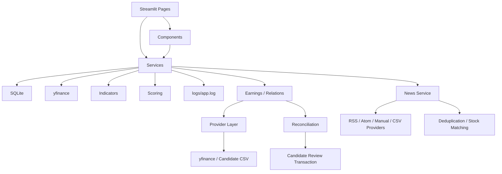

# Architecture

オレ株AIはStreamlitのマルチページアプリとして構成する。

## 画面層

・`app.py`: ダッシュボード  
・`pages/1_保有株.py`: 保有株一覧  
・`pages/2_監視銘柄.py`: 監視銘柄一覧  
・`pages/3_買い検討ライン.py`: 買い検討価格の到達確認  
・`pages/4_チャート.py`: Plotlyチャート  
・`pages/5_決算.py`: 決算カレンダー、決算CRUD、関連銘柄、影響予定、CSV
・`pages/6_設定.py`: 設定、CSV、銘柄登録
・`pages/7_ニュース.py`: ニュース一覧、ソース、キーワード、手動登録、CSV、取得履歴

## Components

・`components/cards.py`: 上部メトリクス表示  
・`components/charts.py`: Plotlyチャート生成  
・`components/forms.py`: 銘柄CRUD、CSV入出力  
・`components/tables.py`: 表示用テーブル整形

## Services

・`services/database.py`: SQLite初期化、CRUD、設定保存  
・`services/stock_data.py`: yfinance取得、分析行生成、ChatGPT用プロンプト  
・`services/indicators.py`: 移動平均、RSI、MACD、出来高倍率、乖離率、下落率  
・`services/scoring.py`: 注目スコアと理由生成  
・`services/settings.py`: 設定の初期値、マージ、バリデーション
・`services/view_models.py`: ページ固有の絞り込み、並び替え、買い検討ライン判定
・`services/migrations.py`: schema_versionと冪等なDBマイグレーション
・`services/earnings.py`: 決算CRUD、日付判定、決算CSV
・`services/relations.py`: 有向関連銘柄CRUD、影響候補、関連CSV
・`services/earnings_view_models.py`: 決算日、曜日、状態、欠損値の表示整形
・`services/earnings_providers/base.py`: プロバイダー共通契約と取得結果
・`services/earnings_providers/yfinance_provider.py`: yfinance返却形式の隔離と正規化
・`services/earnings_providers/csv_provider.py`: 候補CSV行の正規化
・`services/earnings_reconciliation.py`: 既存決算との比較と差分表示
・`services/earnings_candidates.py`: 候補、履歴、取得制限、承認トランザクション
・`components/earnings_auto_fetch.py`: 取得・候補・履歴・設定UI
・`services/daily_briefing.py`: ブリーフィング集計と今日やることの純粋View Model
・`components/daily.py`: ブリーフィング、優先タスク、株・決算カード
・`components/news_cards.py`: ニュースの直接操作カード
・`components/layout.py`: 対象画面の共通レスポンシブ調整
・`services/news.py`: 記事・ソース・キーワード・タグ・取得履歴、重複排除、銘柄照合、CSV、プロンプト
・`services/news_providers/base.py`: ニュースプロバイダー共通契約
・`services/news_providers/rss_provider.py`: 標準ライブラリによるRSS/Atom取得と正規化
・`services/news_providers/manual_provider.py`: 手動入力の正規化
・`services/news_providers/csv_provider.py`: 記事CSV行の正規化

## 候補承認フロー

`Provider -> EarningsFetchResult -> Reconciliation -> earnings_candidates -> 人間確認 -> Transaction -> earnings_events`

プロバイダー取得時点では正式イベントを更新しない。承認時だけ候補状態と正式イベントを同一トランザクションで更新する。

## キャッシュ

株価取得はStreamlitの `st.cache_data` を使用する。設定のキャッシュ分数から時間バケットを作り、指定時間ごとに再取得される。

## ログ

`utils/logging_config.py` で `logs/app.log` へ出力する。ネットワーク、SQLite、CSV、計算中の例外を記録する。

## テスト

`tests/` は外部ネットワークに依存しない。指標、スコア、入力検証、SQLite処理をpytestで確認する。
